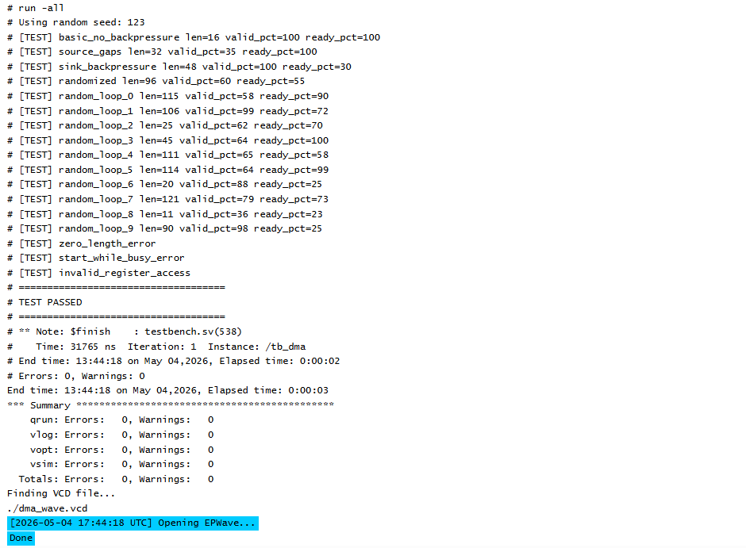
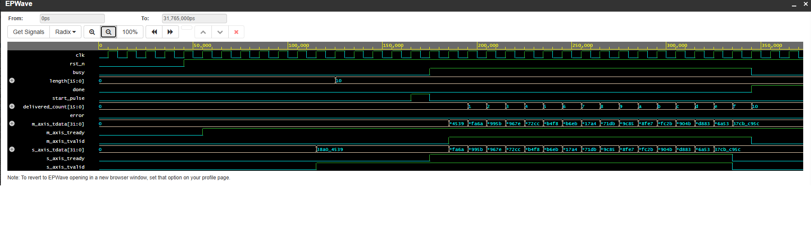

# AXI4-Lite Controlled AXI-Stream DMA Engine

A RTL + verification project for digital design / ASIC verification roles.

This project implements a register-controlled streaming DMA datapath using SystemVerilog RTL. A CPU-style AXI4-Lite register block programs transfer length and start/clear commands. The DMA core moves data from an input AXI-Stream channel to an output AXI-Stream channel while handling backpressure, sticky status, error cases, and transfer accounting.


## Block diagram

```text
             AXI4-Lite Register Bus
        AW/W/B/AR/R channels from CPU/testbench
                         |
                         v
+---------------------------------------------------+
|                    dma_top                        |
|                                                   |
|  +----------------+       +--------------------+  |
|  | axi_lite_regs  |-----> |    dma_engine      |  |
|  | CTRL/LEN/STAT  |      | FSM + counters      |  |
|  +----------------+      +--------------------+  |
|                                ^        |         |
|                                |        v         |
|                           S_AXIS     M_AXIS       |
+---------------------------------------------------+
```

## Register map

| Address | Name   | Access | Description |
|--------:|--------|:------:|-------------|
| `0x00`  | CTRL   | W/R    | bit0=start pulse, bit1=soft reset pulse, bit2=clear status pulse |
| `0x04`  | LENGTH | W/R    | Number of stream beats to transfer |
| `0x08`  | STATUS | R      | bit0=busy, bit1=done, bit2=error |
| `0x0C`  | COUNT  | R      | Number of beats delivered on output stream |


## Simulation Results

The design was compiled and simulated on EDA Playground using QuestaSim.

- Compile: PASS
- Simulation: PASS
- Warnings: 0
- Errors: 0
- Testbench: self-checking randomized SystemVerilog testbench
- Waveform: generated using VCD / EPWav




### Basic DMA Transfer Waveform

Waveform showing a programmed AXI-Stream DMA transfer with `length = 0x10`. The `start_pulse` initiates the transfer, `busy` stays asserted during streaming, `delivered_count` increments for each successful ready/valid handshake, and `done` asserts after all 16 beats are transferred with `error = 0`.




Designed and verified a SystemVerilog AXI4-Lite controlled AXI-Stream DMA engine with ready/valid flow control, transfer length tracking, busy/done status logic, scoreboard-based checking, and passing QuestaSim simulation.


